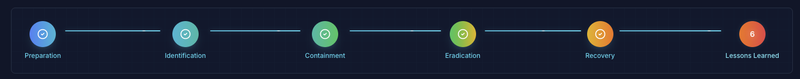
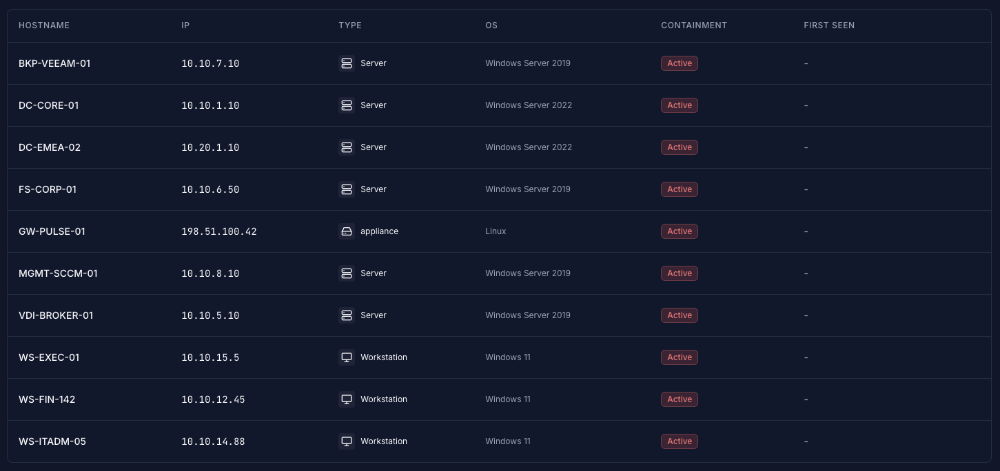
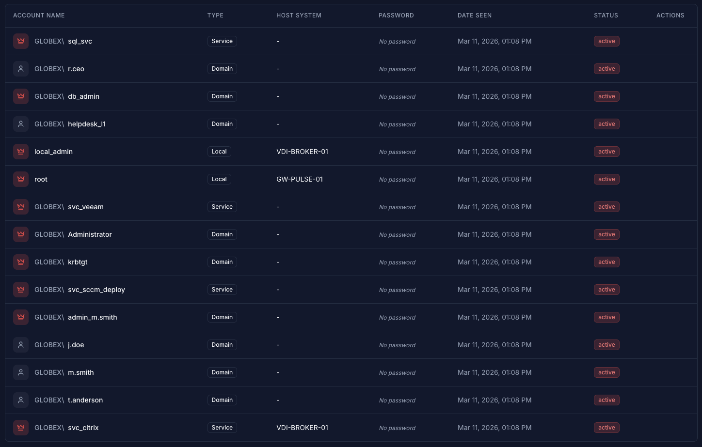
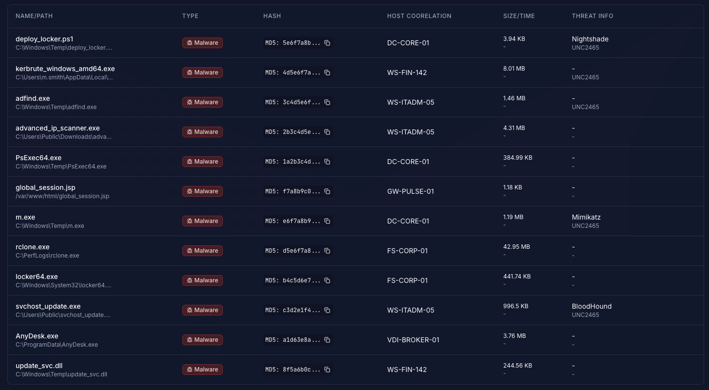
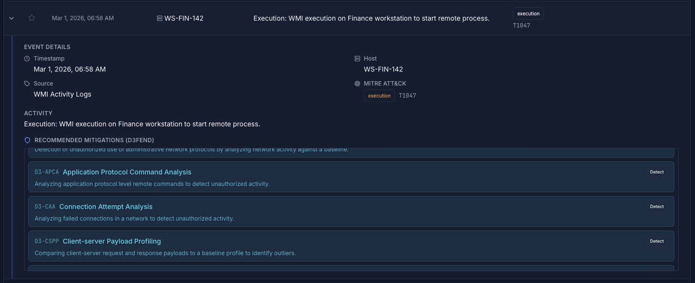
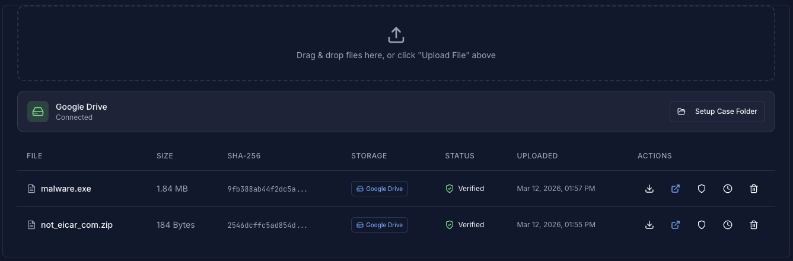
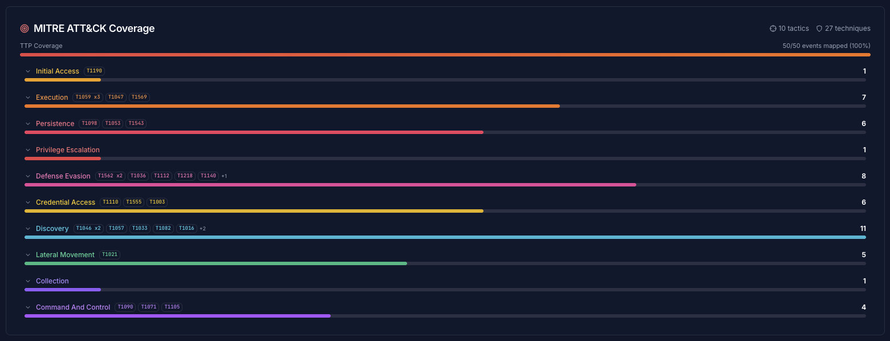
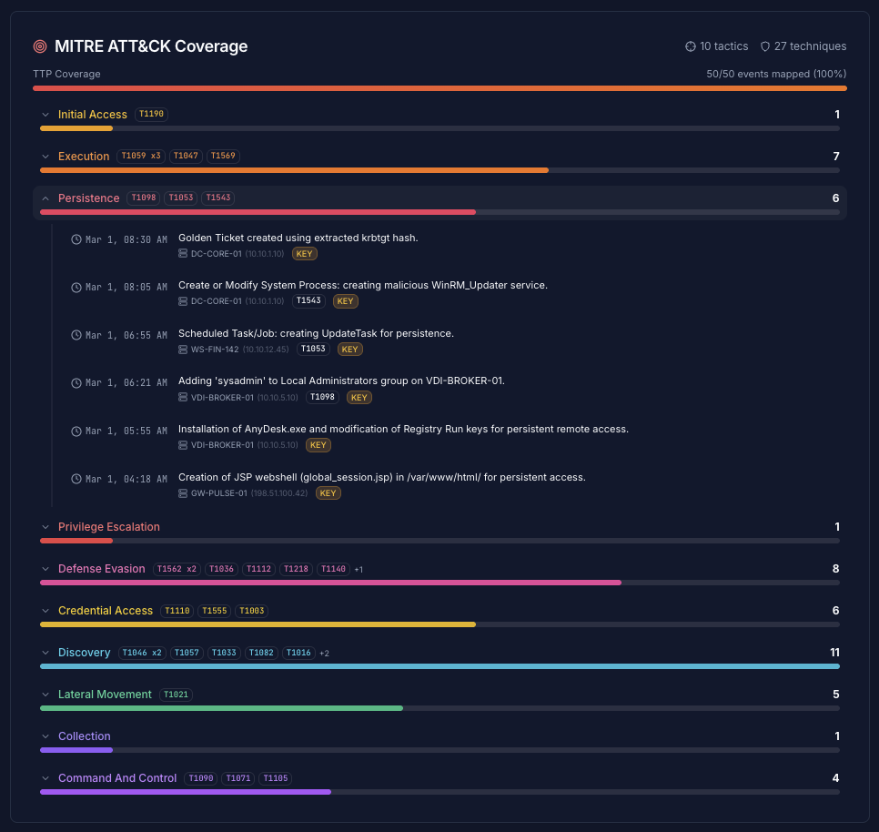
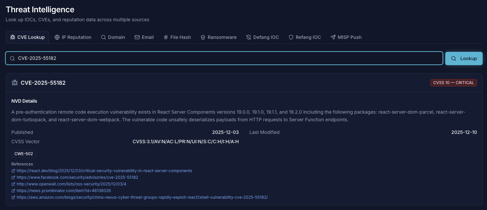
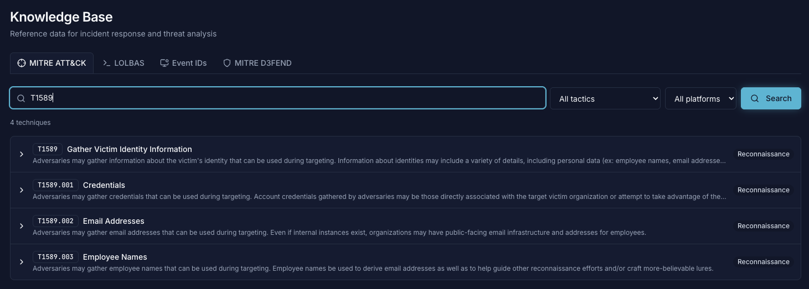

<p align="center">
  <h1 align="center">⚡ SheetStorm</h1>
  <p align="center">
    <strong>Free & Open-Source Incident Response Platform</strong>
    <br />
    Track incidents, map attack paths, collaborate in real time, and generate AI-powered reports — all in one place.
    <br /><br />
    <a href="https://github.com/7a336e6e/sheetstorm/blob/main/LICENSE"></a>
    <a href="https://github.com/7a336e6e/sheetstorm"></a>
  </p>
</p>

<br />

## Why SheetStorm?

Many security teams still rely on shared spreadsheets to coordinate during incidents. They're familiar, fast to set up, and everyone knows how to use them. That approach works — until it doesn't. Concurrent edits, lost context, no audit trail, and zero integration with the tools responders actually need.

SheetStorm is a **free, open-source alternative** purpose-built for DFIR practitioners. It covers the full incident response lifecycle and is designed to be useful whether you're a **solo analyst learning the ropes**, a **training lab instructor**, or running an **enterprise SOC**.

```
Preparation → Identification → Containment → Eradication → Recovery → Lessons Learned
```

> SheetStorm doesn't aim to replace commercial SOAR platforms. It fills the gap between ad-hoc spreadsheets and heavyweight enterprise tools — giving every responder access to structured, collaborative IR for free.

---

## What You Get

<picture>
  <source media="(prefers-color-scheme: dark)" srcset="assets/images/dark_mode/incident_phases.png">
  <source media="(prefers-color-scheme: light)" srcset="assets/images/light_mode/incident_phases.png">
  
</picture>

<br /><br />

### 🔍 Investigate & Track

Track compromised hosts, accounts, network and host IOCs, and malware samples. Map findings to MITRE ATT&CK tactics and techniques. Import existing data from Excel or CSV.

<picture>
  <source media="(prefers-color-scheme: dark)" srcset="assets/images/dark_mode/host_tracking.png">
  <source media="(prefers-color-scheme: light)" srcset="assets/images/light_mode/host_tracking.png">
  
</picture>

<br /><br />

<picture>
  <source media="(prefers-color-scheme: dark)" srcset="assets/images/dark_mode/account_tracking.png">
  <source media="(prefers-color-scheme: light)" srcset="assets/images/light_mode/account_tracking.png">
  
</picture>

<br /><br />

<picture>
  <source media="(prefers-color-scheme: dark)" srcset="assets/images/dark_mode/malware_tracking.png">
  <source media="(prefers-color-scheme: light)" srcset="assets/images/light_mode/malware_tracking.png">
  
</picture>

<br /><br />

### 📋 Timeline & Evidence

Build a chronological event timeline with kill-chain phase tagging and MITRE ATT&CK mapping. Store artifacts with hash verification and full chain of custody.

<picture>
  <source media="(prefers-color-scheme: dark)" srcset="assets/images/dark_mode/expanded_event_entry.png">
  <source media="(prefers-color-scheme: light)" srcset="assets/images/light_mode/expanded_event_entry.png">
  
</picture>

<br /><br />

<picture>
  <source media="(prefers-color-scheme: dark)" srcset="assets/images/dark_mode/artifact_storage.png">
  <source media="(prefers-color-scheme: light)" srcset="assets/images/light_mode/artifact_storage.png">
  
</picture>

<br /><br />

### 🕸️ MITRE ATT&CK Coverage

Automatically map incident activity to MITRE ATT&CK and visualize your coverage across tactics and techniques.

<picture>
  <source media="(prefers-color-scheme: dark)" srcset="assets/images/dark_mode/mitre_att&ck_coverage.png">
  <source media="(prefers-color-scheme: light)" srcset="assets/images/light_mode/mitre_att&ck_coverage.png">
  
</picture>

<br /><br />

<picture>
  <source media="(prefers-color-scheme: dark)" srcset="assets/images/dark_mode/mitre_att&ck_coverage_expanded.png">
  <source media="(prefers-color-scheme: light)" srcset="assets/images/light_mode/mitre_att&ck_coverage_expanded.png">
  
</picture>

<br /><br />

### 🔎 Threat Intelligence & Knowledge Base

Look up CVEs (CISA KEV + CVSS), IP/domain/email reputation, and ransomware victims. Access built-in knowledge bases for LOLBAS, Windows Event IDs, and MITRE D3FEND defensive countermeasures.

<picture>
  <source media="(prefers-color-scheme: dark)" srcset="assets/images/dark_mode/threat_intelligence.png">
  <source media="(prefers-color-scheme: light)" srcset="assets/images/light_mode/threat_intelligence.png">
  
</picture>

<br /><br />

<picture>
  <source media="(prefers-color-scheme: dark)" srcset="assets/images/dark_mode/knowledge_base.png">
  <source media="(prefers-color-scheme: light)" srcset="assets/images/light_mode/knowledge_base.png">
  
</picture>

<br /><br />

### And More

- **AI-Powered Reports** — generate executive summaries, IOC analysis, metrics, and trend reports via OpenAI GPT-4 or Google Gemini, with PDF export and Google Drive auto-save.
- **Attack Graph Visualization** — auto-generated interactive attack graphs with 11 node types and 12 edge types, real-time sync between team members.
- **Real-time Collaboration** — WebSocket-powered live updates, so your entire team sees changes as they happen.
- **RBAC & Security** — 6 roles with 40+ granular permissions, MFA/TOTP, SSO (SAML/OIDC), encrypted credential storage, and full audit trail.
- **MCP Server** — 70+ tools for AI assistant integration (Claude, Cursor, custom agents) with OAuth 2.1 auth.
- **IOC Management** — defang/refang IOCs for safe sharing, auto-enrichment when integrations are configured.

---

## Quick Start

```bash
git clone https://github.com/7a336e6e/sheetstorm.git && cd sheetstorm
chmod +x start.sh && ./start.sh
```

That's it. The script generates secrets, builds the Docker containers, runs migrations, and seeds an admin user.

| Service    | URL                              |
|------------|----------------------------------|
| Frontend   | `http://127.0.0.1:3000`         |
| API        | `http://127.0.0.1:5000/api/v1`  |
| MCP Server | `http://127.0.0.1:8811/sse`     |

> **Default login:** `admin@sheetstorm.local` — password is the value of `ADMIN_PASSWORD` in your `.env` file (default: `changeme`).

### Requirements

- Docker & Docker Compose
- ~2 GB RAM for all services
- Ports 3000, 5000, 8811 available

### Optional Integrations

SheetStorm works fully standalone. For enhanced capabilities, you can configure:

- **OpenAI / Google Gemini** — AI-powered report generation
- **VirusTotal** — file and IOC reputation lookups
- **MISP** — IOC sharing with threat intel platforms
- **Google Drive** — auto-save reports to case folders
- **Slack** — incident notifications
- **S3-compatible storage** — artifact storage

See the [Configuration Guide](assets/docs/configuration.md) for details.

---

## Who Is This For?

| Use Case | How SheetStorm Helps |
|----------|----------------------|
| **DFIR Training & Labs** | Hands-on IR lifecycle practice with a realistic platform — no vendor licenses needed. |
| **Small Security Teams** | Structured incident management without the overhead of enterprise SOAR. |
| **Enterprise SOCs** | Self-hosted, extensible IR platform that integrates with existing tools via API and MCP. |
| **CTF & Competitions** | Collaborative incident tracking for blue team exercises. |
| **Solo Analysts** | Organize your investigations with proper evidence handling and timeline tracking. |

---

## Documentation

| Doc | Description |
|-----|-------------|
| [Architecture](assets/docs/architecture.md) | System design, tech stack, project structure |
| [API Reference](assets/docs/api-reference.md) | All REST endpoints with methods and descriptions |
| [WebSocket Events](assets/docs/websocket-events.md) | Socket.IO event payloads (client ↔ server) |
| [Configuration](assets/docs/configuration.md) | Environment variables and service configuration |
| [Development](assets/docs/development.md) | Setup guide, useful commands, migration workflow |
| [MCP Server](assets/docs/mcp-server-roadmap.md) | MCP server tools, prompts, resources, and architecture |
| [Roadmap](assets/docs/roadmap.md) | Project status, planned features, and tech stack details |

---

## Contributing

Contributions are welcome. Whether it's bug reports, feature requests, documentation improvements, or code — open an issue or submit a PR.

---

## License

MIT — see [LICENSE](LICENSE).
